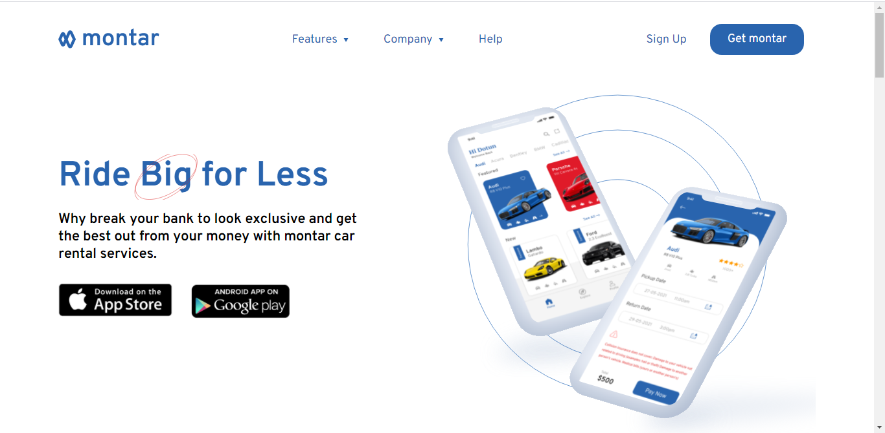

# Montar landing page solution

This is a Frontend design of the landing page [Adedotun Adedimeji](https://www.linkedin.com/in/adedotun-ayodimeji-310697182/) posted on [LinkedIn](hhttps://www.linkedin.com/posts/adedotun-ayodimeji-310697182_howdy-landing-page-design-for-a-car-rental-activity-6804388838379659264-Mvon) a month ago.

## Table of contents

- [Overview](#overview)
  - [The Project](#the-project)
  - [Screenshot](#screenshot)
  - [Links](#links)
- [My process](#my-process)
  - [Built with](#built-with)
  - [What I learned](#what-i-learned)
- [Author](#author)
- [Acknowledgments](#acknowledgments)

## Overview

### The Project

Users should be able to:

- View the optimal layout for the site depending on their device's screen size
- See hover states for all interactive elements on the page

### Screenshot

### Links

- [Live site URL](https://montar-landing-page.vercel.app/)

## My process

### Built with

- Semantic HTML5 markup
- CSS
- Flexbox
- Desktop-first workflow
- Vanilla JavaScript

### What I learned

Building this project, I have been able to work on my frontend development skills which includes:

- Responsive web design
- CSS custom properties
- Using Js for mobile navigation toggle

## Author

- Github - [uzoway](https://github.com/uzoway)
- LinkedIn - [Uzochukwu Victor Okafor](https://www.linkedin.com/in/uzochukwuokafor/)

## Acknowledgments

My gratitute goes to [Adedotun Adedimeji](https://www.linkedin.com/in/adedotun-ayodimeji-310697182/) for allowing me use the design to build out this project.

